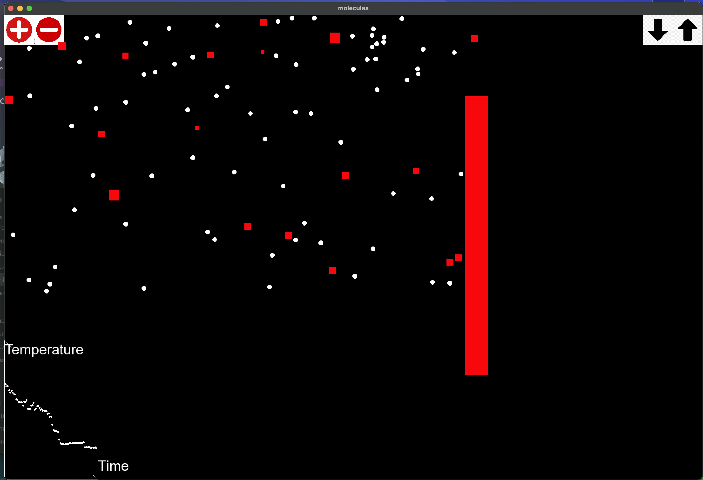

# Molecular Simulator

## Installation and Run

This project utilize SFML.

```
git clone https://github.com/d3clane/molecularSimulator
make
./build/bin/molecules.out
```

## Description

Here how it looks like:



This is a simple molecular simulator. Molecules in the box can physically and chemically interact with each other. There are two types of molecules:
1. Red squares
2. White circles

There is a set of rules when red squares can be converted to white circles and vice versa. 

Also, there is a piston that could be moved using arrows. 

While molecules are chemically interacting, some energy disappears and therefore temperature of the system decreases. At the bottom left graph "Temperature by Time" is built in real time. It's not in real units, more like characteristic ones.

Now, let's move on to architecture of the application.

## Architecture

Overall I am using MVC model. The reason is simple - model of molecules interaction must not be strongly connected to the view of it. For instance, model could be used for some measurement without even drawing it and therefore it is important to separate them. 

In order to help view interact with model (getting positions of molecules, piston, etc.) I use controller. This class is used to connect view and model, while still breaking strong connection between them, enabling to reuse them in the future in other cases. Controller processes input and tune model based on frontend info. On the other hand view interacts with the controller to get information that he need to draw.

Also, while programming this application, I was solving a problem - when molecules interact I want to call a concrete function based on their types - that means, that I want two parameters polymorphic virtual function. However, in C++ there is only one-parameter polymorphic virtual functions (they are polymorphic relatively to this param). So, the solution - to create a 2D vtable by myself as a class and fill it with functions that I need. With using it as a two-dimensional array I could easily call function based on two parameters. Obviously, this approach is easily scalable to any number of parameters.

Chemical engine and physical engine are divided so that they can be changed independently.

Also, in architecture graphics shell layer presents, ensuring that switching to a different graphics library only requires rewriting functions of the particular graphics shell.
